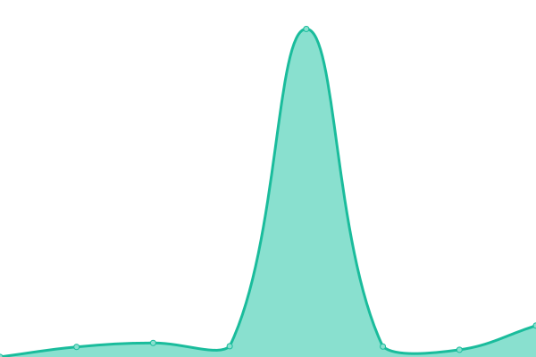
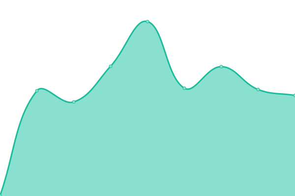
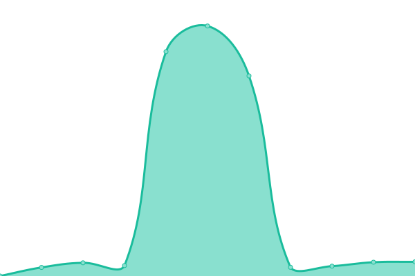
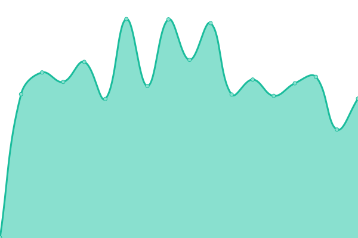

# [📈 Live Status](https://gitetsu.github.io/librex-instances-upptime): <!--live status--> **🟧 Partial outage**

This repository contains the open-source uptime monitor and status page for [gitetsu](https://gitetsu.github.io/librex-instances-upptime), powered by [Upptime](https://github.com/upptime/upptime).

With [Upptime](https://upptime.js.org), you can get your own unlimited and free uptime monitor and status page, powered entirely by a GitHub repository. We use [Issues](https://github.com/gitetsu/librex-instances-upptime/issues) as incident reports, [Actions](https://github.com/gitetsu/librex-instances-upptime/actions) as uptime monitors, and [Pages](https://gitetsu.github.io/librex-instances-upptime) for the status page.

<!--start: status pages-->
<!-- This summary is generated by Upptime (https://github.com/upptime/upptime) -->
<!-- Do not edit this manually, your changes will be overwritten -->
<!-- prettier-ignore -->
| URL | Status | History | Response Time | Uptime |
| --- | ------ | ------- | ------------- | ------ |
|  [search.femboy.hu](https://search.femboy.hu/) | 🟥 Down | [search-femboy-hu.yml](https://github.com/gitetsu/librex-instances-upptime/commits/HEAD/history/search-femboy-hu.yml) | 

 0ms
     
 | 

<a href="https://gitetsu.github.io/librex-instances-upptime/history/search-femboy-hu">0.00%</a>
    

|  [lx.vern.cc](https://lx.vern.cc/) | 🟥 Down | [lx-vern-cc.yml](https://github.com/gitetsu/librex-instances-upptime/commits/HEAD/history/lx-vern-cc.yml) | 

 0ms
     
 | 

<a href="https://gitetsu.github.io/librex-instances-upptime/history/lx-vern-cc">0.00%</a>
    

|  [lx.sesu.cc](https://lx.sesu.cc/) | 🟥 Down | [lx-sesu-cc.yml](https://github.com/gitetsu/librex-instances-upptime/commits/HEAD/history/lx-sesu-cc.yml) | 

 0ms
     
 | 

<a href="https://gitetsu.github.io/librex-instances-upptime/history/lx-sesu-cc">0.00%</a>
    

|  [librex.mikata.ru](https://librex.mikata.ru/) | 🟥 Down | [librex-mikata-ru.yml](https://github.com/gitetsu/librex-instances-upptime/commits/HEAD/history/librex-mikata-ru.yml) | 

 0ms
     
 | 

<a href="https://gitetsu.github.io/librex-instances-upptime/history/librex-mikata-ru">0.00%</a>
    

|  [librex.terryiscool160.xyz](https://librex.terryiscool160.xyz/) | 🟥 Down | [librex-terryiscool160-xyz.yml](https://github.com/gitetsu/librex-instances-upptime/commits/HEAD/history/librex-terryiscool160-xyz.yml) | 

 0ms
     
 | 

<a href="https://gitetsu.github.io/librex-instances-upptime/history/librex-terryiscool160-xyz">0.00%</a>
    

|  [search.milivojevic.in.rs](https://search.milivojevic.in.rs/) | 🟥 Down | [search-milivojevic-in-rs.yml](https://github.com/gitetsu/librex-instances-upptime/commits/HEAD/history/search-milivojevic-in-rs.yml) | 

 0ms
     
 | 

<a href="https://gitetsu.github.io/librex-instances-upptime/history/search-milivojevic-in-rs">0.00%</a>
    

|  [librex.nekus.gay](https://librex.nekus.gay/) | 🟥 Down | [librex-nekus-gay.yml](https://github.com/gitetsu/librex-instances-upptime/commits/HEAD/history/librex-nekus-gay.yml) | 

 0ms
     
 | 

<a href="https://gitetsu.github.io/librex-instances-upptime/history/librex-nekus-gay">0.00%</a>
    

|  [search.davidovski.xyz](https://search.davidovski.xyz/) | 🟩 Up | [search-davidovski-xyz.yml](https://github.com/gitetsu/librex-instances-upptime/commits/HEAD/history/search-davidovski-xyz.yml) | 

 724ms
     
 | 

<a href="https://gitetsu.github.io/librex-instances-upptime/history/search-davidovski-xyz">100.00%</a>
    

|  [search.funami.tech](https://search.funami.tech/) | 🟩 Up | [search-funami-tech.yml](https://github.com/gitetsu/librex-instances-upptime/commits/HEAD/history/search-funami-tech.yml) | 

 512ms
     
 | 

<a href="https://gitetsu.github.io/librex-instances-upptime/history/search-funami-tech">99.76%</a>
    

|  [search.madreyk.xyz](https://search.madreyk.xyz/) | 🟥 Down | [search-madreyk-xyz.yml](https://github.com/gitetsu/librex-instances-upptime/commits/HEAD/history/search-madreyk-xyz.yml) | 

 0ms
     
 | 

<a href="https://gitetsu.github.io/librex-instances-upptime/history/search-madreyk-xyz">0.00%</a>
    

|  [search.pabloferreiro.es](https://search.pabloferreiro.es/) | 🟩 Up | [search-pabloferreiro-es.yml](https://github.com/gitetsu/librex-instances-upptime/commits/HEAD/history/search-pabloferreiro-es.yml) | 

 623ms
     
 | 

<a href="https://gitetsu.github.io/librex-instances-upptime/history/search-pabloferreiro-es">100.00%</a>
    

|  [buscar.weblibre.org](https://buscar.weblibre.org/) | 🟥 Down | [buscar-weblibre-org.yml](https://github.com/gitetsu/librex-instances-upptime/commits/HEAD/history/buscar-weblibre-org.yml) | 

 0ms
     
 | 

<a href="https://gitetsu.github.io/librex-instances-upptime/history/buscar-weblibre-org">0.00%</a>
    

|  [search.ahwx.org](https://search.ahwx.org/) | 🟩 Up | [search-ahwx-org.yml](https://github.com/gitetsu/librex-instances-upptime/commits/HEAD/history/search-ahwx-org.yml) | 

 642ms
     
 | 

<a href="https://gitetsu.github.io/librex-instances-upptime/history/search-ahwx-org">98.15%</a>
    

|  [librex.pufe.org](https://librex.pufe.org/) | 🟩 Up | [librex-pufe-org.yml](https://github.com/gitetsu/librex-instances-upptime/commits/HEAD/history/librex-pufe-org.yml) | 

 704ms
     
 | 

<a href="https://gitetsu.github.io/librex-instances-upptime/history/librex-pufe-org">100.00%</a>
    

|  [librex.ratakor.com](https://librex.ratakor.com/) | 🟥 Down | [librex-ratakor-com.yml](https://github.com/gitetsu/librex-instances-upptime/commits/HEAD/history/librex-ratakor-com.yml) | 

 0ms
     
 | 

<a href="https://gitetsu.github.io/librex-instances-upptime/history/librex-ratakor-com">0.00%</a>
    

|  [search.tildevarsh.in](https://search.tildevarsh.in/) | 🟥 Down | [search-tildevarsh-in.yml](https://github.com/gitetsu/librex-instances-upptime/commits/HEAD/history/search-tildevarsh-in.yml) | 

 0ms
     
 | 

<a href="https://gitetsu.github.io/librex-instances-upptime/history/search-tildevarsh-in">0.00%</a>
    

|  [librex.myroware.eu](https://librex.myroware.eu/) | 🟩 Up | [librex-myroware-eu.yml](https://github.com/gitetsu/librex-instances-upptime/commits/HEAD/history/librex-myroware-eu.yml) | 

 686ms
     
 | 

<a href="https://gitetsu.github.io/librex-instances-upptime/history/librex-myroware-eu">100.00%</a>
    

|  [search.mascotboi.xyz](https://search.mascotboi.xyz/) | 🟥 Down | [search-mascotboi-xyz.yml](https://github.com/gitetsu/librex-instances-upptime/commits/HEAD/history/search-mascotboi-xyz.yml) | 

 372ms
     
 | 

<a href="https://gitetsu.github.io/librex-instances-upptime/history/search-mascotboi-xyz">57.20%</a>
    

|  [lx.drain.win](https://lx.drain.win/) | 🟥 Down | [lx-drain-win.yml](https://github.com/gitetsu/librex-instances-upptime/commits/HEAD/history/lx-drain-win.yml) | 

 0ms
     
 | 

<a href="https://gitetsu.github.io/librex-instances-upptime/history/lx-drain-win">0.00%</a>
    

<!--end: status pages-->

[**Visit our status website →**](https://gitetsu.github.io/librex-instances-upptime)

## 📄 License

- Powered by: [Upptime](https://github.com/upptime/upptime)
- Code: [MIT](./LICENSE) © [gitetsu](https://gitetsu.github.io/librex-instances-upptime)
- Data in the `./history` directory: [Open Database License](https://opendatacommons.org/licenses/odbl/1-0/)
